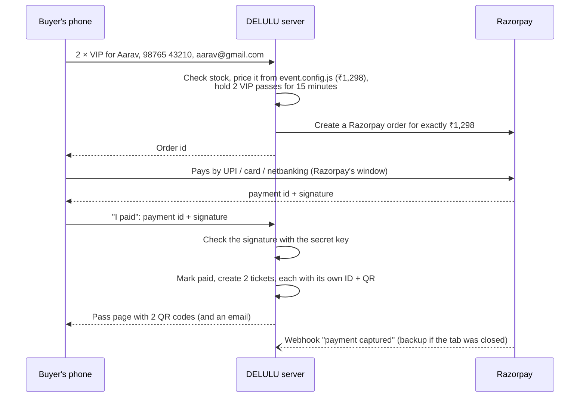
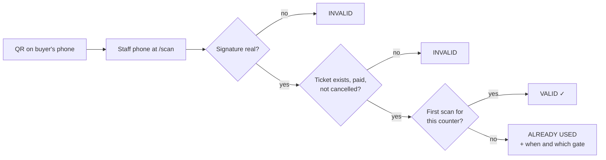

# DELULU Tickets: ticketing OS for Navratri Nights

Your own branded ticketing platform: people buy passes on your site, pay with UPI / cards / netbanking
through Razorpay, get QR passes instantly, and your team scans them at the gate on their phones.

| Page | Who uses it | What it does |
|---|---|---|
| `/` | Buyers | Event hero, pass picker (student passes kept separate from General), live total, checkout |
| `/p/<link>` | Buyers | Their QR passes: one per person, with name, pass type, date, venue and check-in status |
| `/t/<code>` | Buyers' friends | A single pass, forwarded on WhatsApp with "Send this pass" |
| `/scan` | Gate & counter staff (PIN) | Camera scanner → **VALID / ALREADY USED / INVALID**, plus Food & Dandiya-sticks counters |
| `/admin` | You (password) | Sales & revenue, check-ins, search bookings, door sales, comps, cancellations, CSV export |
| `/policies` | Razorpay reviewers | Terms, refunds, privacy, contact (required to activate a Razorpay account) |

Passes and prices live in **`event.config.js`**: Student ₹299 · Student + Food ₹449 · General Adult ₹399 · VIP + Food + Sticks ₹649.

---

## How it works

### 1. Buying a pass



- **The price is decided by the server**, never by the browser. Editing the page can't make passes cheaper.
- **Razorpay's signature** proves the payment is real. Only Razorpay and your server know the secret.
- **Passes are held for 15 minutes** while someone is paying, so two people can't buy the last VIP pass.
  If they abandon checkout, the passes go back on sale automatically.
- **Three ways a payment gets confirmed**, so nobody pays and gets nothing:
  the browser callback, Razorpay's webhook (works even if the phone died), and the pass page
  asking Razorpay directly ("Confirming your payment…"). Whichever comes first issues the tickets;
  the others do nothing, so no duplicates.

### 2. What's inside a QR

Each person gets their own pass, e.g. `DL-7K3M-9QXA`. The QR contains that ID plus an 8-character
**signature** that only your server can make (an HMAC with a secret stored in your database).
Someone who invents a ticket ID or edits a QR gets **INVALID**. Nobody can "generate" passes.

### 3. At the gate



- **One QR = one entry.** The database guarantees it: even if 5 gates scan the same screenshot in the
  same second, exactly one gets VALID (this is tested with 20 simultaneous scans).
- **Student passes** show a big **CHECK COLLEGE ID** banner. No ID? Tap **"No ID, undo"** and the pass is
  not used up. They can upgrade at the door.
- **Food and dandiya-sticks counters** use the same scanner in Food / Sticks mode. Each perk can be
  collected once, and a Student Pass at the food counter shows **NOT INCLUDED**.
- No QR? Type the ticket ID (`DL-7K3M-9QXA`) in the box under the camera.

---

## Try it on your laptop (2 minutes)

You need [Node.js](https://nodejs.org) 20.19 or newer.

```bash
cd delulu-tickets
npm install
npm start
```

Open http://localhost:3000. With no settings it runs in **demo mode**: payments are simulated (a
"Simulate successful payment" button replaces Razorpay) and data is saved in `./data`.
Admin password `admin123`, scanner PIN `1234` (local only).

`npm test` runs the automated checks (buying, signatures, webhooks, sold-out, gate scanning, door sales).

---

## Put it online with Netlify

Netlify serves the pages, and runs the server part as a **Netlify Function**. Tickets are stored in a
free **Supabase** Postgres database, because Netlify doesn't keep files between requests.

> ⚠️ **Don't use Netlify Drop (drag-and-drop a folder/zip).** Drop only publishes static files: the site
> would load, but passes, payments and the scanner would all fail. Use one of the two options below.

### Step 1: Database (Supabase, free)

1. Create a project at [supabase.com](https://supabase.com) (pick the **Mumbai** region).
2. Click **Connect** → copy the **Transaction pooler** connection string (port `6543`) and put your
   database password into it. That's your `DATABASE_URL`.
   The tables are created automatically on the first visit.

### Step 2: Razorpay

1. Sign up at [razorpay.com](https://razorpay.com). In **Test mode**, go to Account & Settings → API Keys →
   generate a key. You get `RAZORPAY_KEY_ID` (`rzp_test_…`) and `RAZORPAY_KEY_SECRET`.
2. Make up a long random `RAZORPAY_WEBHOOK_SECRET` (any password generator).
3. To take real money, complete Razorpay's KYC / website activation. **Edit `public/policies.html`
   first** (replace every `[bracketed]` value); Razorpay checks that page. Then switch to `rzp_live_` keys.

### Step 3: Netlify

**Option A: from GitHub (recommended, redeploys on every push)**

1. Netlify → **Add new site → Import an existing project → GitHub** → pick this repository.
2. **Base directory:** `delulu-tickets` · Build command: *(leave empty)* · Publish directory: `delulu-tickets/public`.
3. Add the environment variables below, then **Deploy**.

**Option B: from the zip, with the Netlify CLI**

```bash
unzip delulu-tickets.zip && cd delulu-tickets
npm install
npx netlify-cli login
npx netlify-cli deploy --build --prod     # first time it asks you to create/link a site
```
Then add the environment variables in the Netlify UI (Site configuration → Environment variables) and redeploy.

**Environment variables**

| Variable | Value |
|---|---|
| `DATABASE_URL` | Supabase transaction pooler string from step 1 |
| `ADMIN_PASSWORD` | 10+ characters, for `/admin` |
| `SCANNER_PIN` | 6+ digits, for gate staff at `/scan` |
| `RAZORPAY_KEY_ID` / `RAZORPAY_KEY_SECRET` | From step 2 |
| `RAZORPAY_WEBHOOK_SECRET` | From step 2 |
| `PUBLIC_URL` | Only if you use your own domain, e.g. `https://tickets.deluluproduction.in` |
| `SMTP_HOST`, `SMTP_PORT`, `SMTP_USER`, `SMTP_PASS`, `MAIL_FROM` | Optional, to email passes (see below) |

Want to show the site before Razorpay is ready? Add `DEMO_MODE=1` instead of the Razorpay keys
(**anyone can then get free passes**, so remove it before announcing the link).

If something is missing, the site shows *"Site setup problem…"* naming the setting. Netlify only
picks up changed variables after a redeploy (Deploys → Trigger deploy).

### Step 4: Razorpay webhook

Razorpay Dashboard → Webhooks → **Add new webhook**:
- URL: `https://<your-site>/api/webhooks/razorpay`
- Secret: the same `RAZORPAY_WEBHOOK_SECRET`
- Events: `payment.captured` and `order.paid`

### Step 5: Test before you announce

With test keys, buy a pass on your phone (Razorpay's test mode accepts test UPI IDs like
`success@razorpay` and the test cards listed in its docs). Check: pass page opens · email arrives ·
`/scan` says VALID, then ALREADY USED · `/admin` shows the sale. Then cancel that booking in `/admin`.

### Email (optional but recommended)

Gmail works: turn on 2-Step Verification, create an **App password**, then set
`SMTP_HOST=smtp.gmail.com`, `SMTP_PORT=465`, `SMTP_USER=you@gmail.com`, `SMTP_PASS=<app password>`.
Personal Gmail caps sending at a few hundred emails a day; for bigger sales use a sender like Brevo or Resend (also SMTP).
Without email, buyers still get their passes on screen, and you can WhatsApp anyone their link from `/admin`.

### Other hosts

It's a normal Node app too: `npm start` on Render, Railway or any VPS works (set the same variables
plus `NODE_ENV=production`). Without `DATABASE_URL` it uses the built-in database in `DATA_DIR`,
which needs a persistent disk.

---

## Changing the event

Edit `event.config.js` and redeploy:
- `event`: name, date, time, venue, contact. **The date and time are placeholders, so fill them in.**
- `passes`: names, prices, what's included, and **`capacity`** (how many of each can be sold;
  `null` = unlimited). Set `totalCapacity` to your venue limit. Sold-out passes grey out automatically.
- `salesOpen: false` stops online sales (door sales still work).
- Never change a pass `id` once tickets are sold.

---

## Event-day runbook

**Before doors open**
- Give staff the `/scan` link and the PIN. Each logs in with a name like "Main Gate" or "Food Counter"
  (counters named Food/Sticks open in that mode). Allow camera access and test-scan one pass.
- Staff phones need internet (mobile data or venue Wi-Fi), full charge, power banks.
- Download the **CSV** from `/admin` as a backup guest list in case the internet fails.

**At the gate**
- 🟢 VALID → let them in. Student pass → check the college ID first (or tap "No ID, undo").
- 🔴 ALREADY USED → shows when and where it was first scanned. Someone shared a screenshot.
- 🔴 INVALID → fake, edited, cancelled or not a DELULU pass.
- QR won't read → ask them to raise brightness, or type the ticket ID under the camera.

**Common situations**
- *"I paid but got no pass"* → `/admin`, search their phone number → if it's **Pending**, tap
  **Check payment with Razorpay**. If Razorpay has the money, the passes are issued on the spot.
- *Walk-in buying at the gate* → `/admin` → **Sell at door / Comp** → collect cash/UPI, issue passes,
  show them the QR or WhatsApp it.
- *Guest list / sponsors / crew* → same form, type **Complimentary**.
- *Refund* → refund in the Razorpay dashboard, then **Cancel booking** in `/admin` (its passes stop working).
- *Scanned by mistake* → `/admin` → find the booking → **Undo check-in**.

---

## Under the hood

| Path | What's in it |
|---|---|
| `event.config.js` | Event details, passes, prices, capacities, perks |
| `src/service.js` | All the rules: orders, stock, payments, tickets, scanning, admin |
| `src/app.js` | Web routes (`/api/...`) |
| `src/razorpay.js` | Razorpay orders, signature + webhook checks |
| `src/codes.js` | Ticket IDs and QR signatures |
| `src/db.js` | Database tables (Postgres, or built-in PGlite locally) |
| `netlify/functions/api.mjs` | Runs the app on Netlify |
| `public/` | The website, pass page, scanner and admin screens |
| `test/` | Automated end-to-end tests |

Security notes: staff and admin logins are signed, HTTP-only cookies; wrong-PIN guessing is rate-limited
per device and globally; buyers' pass links are unguessable; the pass page never shows phone or email;
the CSV export defuses spreadsheet formulas; production refuses to start with missing secrets or fake payments.
